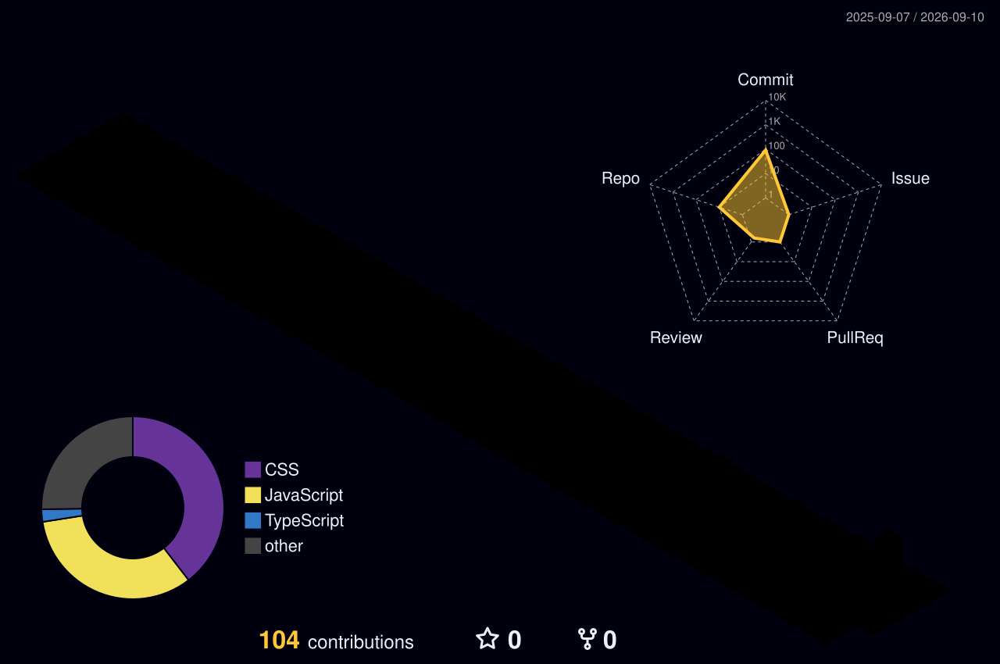

<!-- minnnnnngun GitHub Profile README -->

  

  

<h1 align="center">👋 안녕하세요, minnnnnngun입니다</h1>

  <strong>React를 중심으로 인터페이스를 만들고, 작은 아이디어를 실제 화면으로 바꾸고 있습니다.</strong>

  <em>Build small. Learn fast. Keep exploring. 🚀</em>

  

<pre>
┌─────────────────────────────────────┐
│  USER      : minnnnnngun             │
│  ROLE      : Frontend Explorer       │
│  FOCUS     : UI · Interaction        │
│  STATUS    : build & learn            │
│  CURIOSITY : unlimited               │
└─────────────────────────────────────┘
</pre>

## 🧰 Tech Stack

<table align="center">
  <tr>
    <td align="center" width="220">
      
       
      <strong>React</strong>
       
      UI · Component Development
    </td>
  </tr>
</table>

## 🌐 Languages

<table align="center">
  <tr>
    <td align="center" width="120">
      
       
      <strong>JavaScript</strong>
    </td>
    <td align="center" width="120">
      
       
      <strong>TypeScript</strong>
    </td>
    <td align="center" width="120">
      
       
      <strong>HTML</strong>
    </td>
    <td align="center" width="120">
      
       
      <strong>CSS</strong>
    </td>
    <td align="center" width="120">
      
       
      <strong>C</strong>
    </td>
  </tr>
</table>

## 📊 GitHub Stats

  

## 🔥 Most Used Language

  

  <strong>공개 저장소의 코드 비율을 기준으로 가장 많이 사용하는 언어를 보여줍니다.</strong>

## 📚 Repository Commit Log

  <strong>내 공개 저장소별 커밋 수를 자동으로 집계합니다.</strong>

<!-- REPO_COMMIT_STATS:START -->

  <em>GitHub Actions가 저장소별 커밋 수를 계산하면 이 영역이 자동으로 갱신됩니다.</em>

<!-- REPO_COMMIT_STATS:END -->

## 🐤 Productive Box · Commit Time Statistics

  

  <strong>커밋 시간대를 분석해 아침형 🐤 또는 야행성 🦉 패턴을 보여줍니다.</strong>

## 🛰️ Contribution Orbit

  

  

## 🌈 Contribution Map

  

## 📫 Contact

&nbsp;&nbsp;&nbsp;&nbsp;

  <em>Keep building. Keep exploring. 🚀</em>

  

